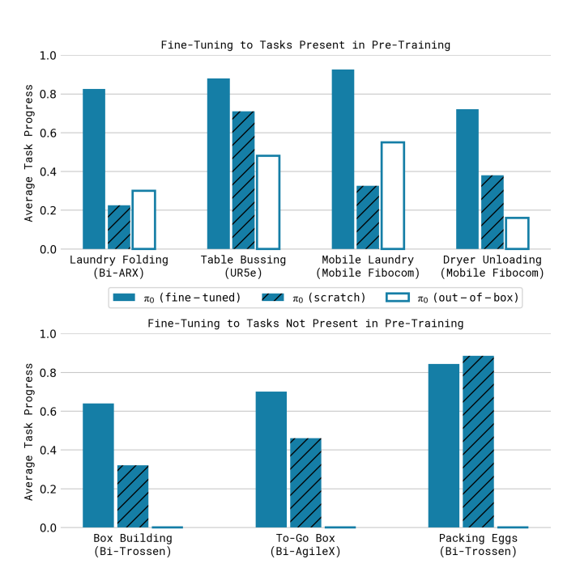

OpenPi Training & Evaluating a Policy with LeRobot
====================================================

.. warning::

   This is an experimental tutorial and may change in the future.
   Also, minimal testing has been done on the Trossen AI setup and results may vary.

Background
----------

Refer to the `Pi-0 Paper <https://www.physicalintelligence.company/download/pi0.pdf>`_ for understanding the model architecture and training procedure.
Also, look into the limitations section for known issues and challenges. 
In order to get good results, a good quality dataset is necessary as mentioned in the paper.

    Our experiments imply that an analogous phenomenon might take place with robot foundation models, where pre-trained models have some zero-shot capabilities, but complex tasks like laundry following require fine-tuning with high-quality data.
    Training on only this high-quality data results in a brittle model that does not reliably recover from mistakes, while running the pre-trained model in zero shot does not always exhibit the fluent strategies demonstrated in the post-training data.

The paper also mentions it's experimental setup and success results, which can be used as a reference for your own experiments.
One such setup is mentioned as follows:

    Shirt folding: Shirt folding is recorded as either success or failure.
    We begin each shirt folding eval by laying the shirt flat on the table.
    Success is defined as having folded in the sleeves and performed one half-fold along the length of the shirt.
    Our eval includes 4 small t-shirts and 1 medium t-shirt.
    We run 2 evals for each item for a maximum of 15000 steps or approximately 5 minutes each.

These are the results from the original paper, showing average scores per task over 10 trials, are presented in figure below.
The scoring rubrics are mentioned in the paper appendix.
A score of 1.0 represents a perfect execution, while partial scores correspond to partially completed tasks (e.g., 0.5 for a shirt that is half-folded).

These are the **original Pi-0 results**, provided here to set expectations.  
Since **Trossen AI arms were not part of the original Pi-0 training dataset**, performance may be weaker out of the box.
However, we found that **fine-tuning on a small, high-quality dataset** can still yield useful performance (see :ref:`results-section`).

This tutorial walks you through:

- Collecting episodes  
- Training with OpenPi  
- Fine-tuning using LoRA  
- Evaluating policies  
- Running inference  

Collect Episodes using LeRobot
------------------------------

We collect episodes using ``Interbotix/lerobot``. For more information on installation and recording episodes check the following:

#. `Installation <https://docs.trossenrobotics.com/trossen_arm/main/tutorials/lerobot/setup.html>`_
#. `Recording Episode <https://docs.trossenrobotics.com/trossen_arm/main/tutorials/lerobot/record_episode.html>`_

Here is a recorded dataset using the above instructions:

- `Bimanual WidowX-AI Handover Cube <https://huggingface.co/datasets/TrossenRoboticsCommunity/bimanual-widowxai-handover-cube>`_

You can also visualize the dataset using the following link. Just paste the dataset name here:

- `Visualize using this <https://huggingface.co/spaces/lerobot/visualize_dataset>`_

Install UV
----------

Install `uv <https://docs.astral.sh/uv/getting-started/installation/>`_ for dependency management.

OpenPi Setup
------------

When cloning this repo, make sure to update submodules:

.. code-block:: bash

   git clone --recurse-submodules git@github.com:TrossenRobotics/openpi.git

   # Or if you already cloned the repo:
   git submodule update --init --recursive

We use `uv <https://docs.astral.sh/uv/>`_ to manage Python dependencies. Once uv is installed, run the following to set up the environment:

.. code-block:: bash

   GIT_LFS_SKIP_SMUDGE=1 uv sync
   GIT_LFS_SKIP_SMUDGE=1 uv pip install -e .

.. note::

   ``GIT_LFS_SKIP_SMUDGE=1`` is needed to pull LeRobot as a dependency.

Training
--------

Once you have recorded your dataset, you can begin training using the command below.
We provide a custom training configuration for the Trossen AI dataset.
Since the Aloha Legacy and Trossen AI Stationary share the same joint layout, this configuration is compatible.
Explicit support for Trossen AI will be added in the future.

Run this command from the project root:

.. code-block:: bash

   cd openpi

.. code-block:: bash

   XLA_PYTHON_CLIENT_MEM_FRACTION=0.9 uv run scripts/train.py pi0_trossen_transfer_block --exp-name=my_experiment --overwrite

Custom Training Configuration
-----------------------------

To add a custom training configuration, edit the ``openpi/src/training/config.py`` file.
You can define your own ``TrainConfig`` with specific model parameters, dataset sources, prompts, and training options.
After updating the configuration, reference your new config name in the training command:

.. code-block:: bash

   XLA_PYTHON_CLIENT_MEM_FRACTION=0.9 uv run scripts/train.py <your_custom_config_name> --exp-name=my_experiment --overwrite

Example configuration for training on the Trossen AI dataset:

.. code-block:: python

   TrainConfig(
       name="pi0_trossen_transfer_block",
       model=pi0.Pi0Config(paligemma_variant="gemma_2b_lora", action_expert_variant="gemma_300m_lora"),
       data=LeRobotAlohaDataConfig(
           use_delta_joint_actions=False,
           adapt_to_pi=False,
           repo_id="TrossenRoboticsCommunity/bimanual-widowxai-handover-cube",
           assets=AssetsConfig(
               assets_dir="gs://openpi-assets/checkpoints/pi0_base/assets",
               asset_id="trossen",
           ),
           default_prompt="grab and handover the red cube",
           repack_transforms=_transforms.Group(
               inputs=[
                   _transforms.RepackTransform(
                       {
                           "images": {
                               "cam_high": "observation.images.top",
                               "cam_left_wrist": "observation.images.left",
                               "cam_right_wrist": "observation.images.right",
                           },
                           "state": "observation.state",
                           "actions": "action",
                       }
                   )
               ]
           ),
       ),
       weight_loader=weight_loaders.CheckpointWeightLoader("gs://openpi-assets/checkpoints/pi0_base/params"),
       num_train_steps=20_000,
       batch_size=2,
       freeze_filter=pi0.Pi0Config(
           paligemma_variant="gemma_2b_lora", action_expert_variant="gemma_300m_lora"
       ).get_freeze_filter(),
       # Turn off EMA for LoRA finetuning.
       ema_decay=None,
   )

We trained on a RTX5090 and fine-tuned using LoRA.

Checkpoints
-----------

Checkpoints are stored in the ``checkpoints`` folder at the root of your project directory.

To use a pretrained policy, download and extract the following checkpoint into your ``checkpoints`` directory:

- `OpenPi Fine-Tuned Checkpoint on Hugging Face <https://huggingface.co/shantanu-tr/open_pi_finetune_checkpoint>`_

Running Inference with Your Trained Policy
------------------------------------------

Once training is complete and your checkpoint is ready, you can start the policy server and run the client.

Start the Policy Server
~~~~~~~~~~~~~~~~~~~~~~~

Launch the policy server using your trained checkpoint and configuration:

.. code-block:: bash

   uv run scripts/serve_policy.py policy:checkpoint \
       --policy.config=pi0_trossen_transfer_block \
       --policy.dir=checkpoints/pi0_trossen_transfer_block/test_pi0_finetuning/19999

.. code-block:: bash

   uv run scripts/serve_policy.py policy:checkpoint \
       --policy.config=pi0_trossen_transfer_block \
       --policy.dir=checkpoints/pi0_trossen_transfer_block/block_transfer_training_100k/99999

Start the Client
~~~~~~~~~~~~~~~~
.. note::

    The client script requires the **latest version of LeRobot**, while the OpenPi repository depends on an older version for data loading.  
    To prevent version conflicts, the ``trossen_ai`` package uses the ``Interbotix/lerobot`` repository as its dependency.  
    When using ``uv`` for package management, this setup creates a **separate virtual environment** for ``trossen_ai``.  
    If you need to modify any LeRobot packages, ensure you are editing them in the **correct environment**.

Before running the client, make sure that your **Trossen AI arms and cameras** are properly set up and connected to your network.

You can edit the **camera and arm IP address configuration** directly in the script:

.. code-block:: python

   bi_widowx_ai_config = BiWidowXAIFollowerConfig(
       left_arm_ip_address="192.168.1.5",
       right_arm_ip_address="192.168.1.4",
       min_time_to_move_multiplier=4.0,
       id="bimanual_follower",
       cameras={
           "top": RealSenseCameraConfig(
               serial_number_or_name="218622270304",
               width=640, height=480, fps=30, use_depth=False
           ),
           "bottom": RealSenseCameraConfig(
               serial_number_or_name="130322272628",
               width=640, height=480, fps=30, use_depth=False
           ),
           "right": RealSenseCameraConfig(
               serial_number_or_name="128422271347",
               width=640, height=480, fps=30, use_depth=False
           ),
           "left": RealSenseCameraConfig(
               serial_number_or_name="218622274938",
               width=640, height=480, fps=30, use_depth=False
           ),
       }
   )

The client script provides parameters to control both the **rate of inference** and **temporal ensembling**.  

The **rate of inference** determines how often the policy is queried for new actions.  
Since each query is computationally expensive, frequent queries reduce the control frequency to around **10 Hz**, which can lead to jerky motions.  
To avoid this, you should choose a rate that balances **smoothness** and **responsiveness**.  

- According to the Pi-0 paper, the control loop runs at **50 Hz**, with inference every **0.5 s** (after 25 actions).  
- In our case, the control loop runs at **30 Hz** to align with the camera frame rate.  

Practical trade-offs:

- **Rate = 50** → smoother motion, less responsive to environment changes.  
- **Rate = 25** → more responsive, but noticeably jerky motion.  

Depending on your setup, you may need to adjust this parameter for optimal performance.

.. code-block:: python

   self.rate_of_inference = 50  # Number of control steps per policy inference

**Temporal ensembling** is a technique for smoothing the actions generated by the policy.  
It was originally introduced in the `ACT paper <https://arxiv.org/abs/2304.13705>`_, and later mentioned in the Pi-0 paper.  

While simple to implement, the **Pi-0 appendix notes that temporal ensembling can actually hurt performance**.  
Our own experiments confirmed this — we observed no benefit, so by default the temporal ensembling weight is set to ``None``.  

That said, we have included an implementation of temporal ensembling in the client script for users who wish to experiment with it.

.. code-block:: python

   self.m = None  # Temporal ensembling weight (None = no ensembling)

Run the client to interact with the policy server:

.. code-block:: bash

   cd examples/trossen_ai
   uv run main.py --mode autonomous --task_prompt "grab red cube"

Results
-------

Here are some preliminary results from our experiments with the Pi-0 policy on the bimanual WidowX setup.

- The Pi-0 base checkpoint has no episodes collected using Trossen-AI arms, so fine tuning is necessary.
- We collected a small dataset of 50 episodes (very small compared to other robot modalities).
- Zero-shot inference may be difficult as environment changes (color, shape, etc.) affect performance.
- Dataset collected in a highly controlled environment.

Results folder: 
`Google Drive <https://drive.google.com/drive/folders/1waFcKihP8uAHSsV8VM-S7eBLDdTW7jfw?usp=sharing>`_

Scenarios:

1. ``openpi_trossen_ai_red_block [success]`` : Robot successfully picks up and transfers red block in second try.
2. ``openpi_trossen_ai_blue_lego [fail]`` : Robot fails due to different block size and color.
3. ``openpi_trossen_ai_environment_disturbances [fail]`` : Robot struggles under disturbances.
4. ``openpi_trossen_ai_wooden_block [fail]`` : Robot fails with wooden block, poor generalization.

We used the same command for all tests:

.. code-block:: bash

   uv run main.py --mode autonomous --task_prompt "grab red cube"
