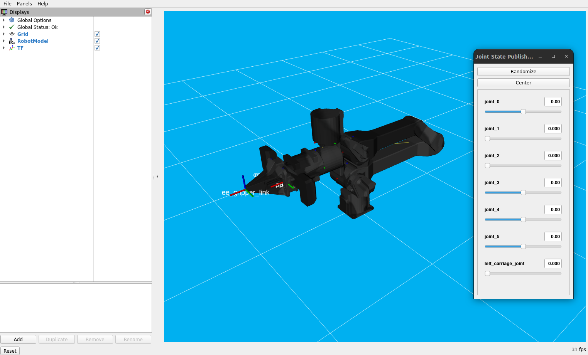

=======================
Trossen Arm Description
=======================

The Trossen Arm Description package provides description files for the Trossen Arms.

Usage
=====

To visualize the Trossen Arm in RViz, you can use the following command:

.. code-block:: bash

    source ~/ros2_ws/install/setup.bash
    ros2 launch trossen_arm_description display.launch.py robot_model:=wxai use_joint_pub_gui:=true

This will bring up RViz with the Trossen Arm model loaded, allowing you to visualize the arm and its joints.
Setting the ``use_joint_pub_gui`` launch argument to ``true`` launches a GUI that allows users to manually control the arm's joints.

Next Steps
==========

Now that you are able to visualize the Trossen Arm, you can proceed to the next tutorial to learn how to control the arm using ros2_control in :doc:`the Trossen Arm Bringup package<./bringup>`.
