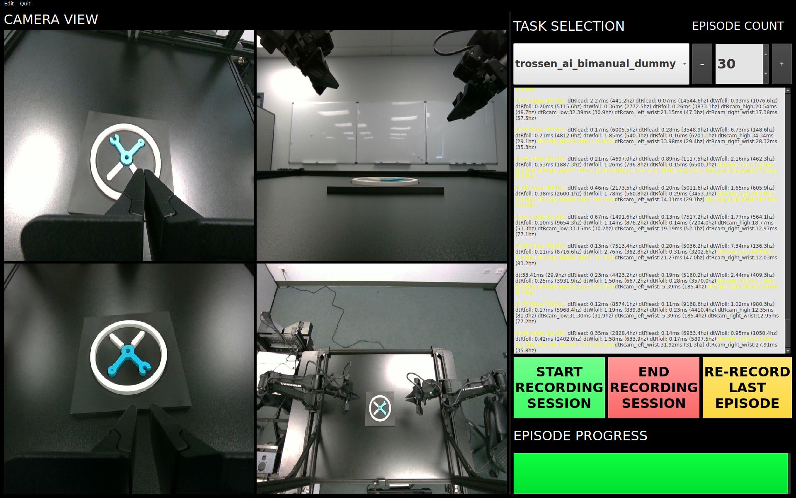

=============================
Trossen AI Data Collection UI
=============================

Overview
========

The **Trossen AI Data Collection UI** is a Python-based graphical user interface (GUI) designed for seamless and efficient robotic data collection.
It allows users to easily manage robot configurations, record tasks, and streamline data collection with real-time feedback, camera views, task management, and progress tracking.
This documentation provides a comprehensive guide to setting up, installing, and using the Trossen AI Data Collection UI, including all its features and functionalities.

Pre-Installation Setup
======================

Before installing the application, complete the following setup steps:

#. Install Miniconda:

   Download and install Miniconda, a minimal installer for Conda. It simplifies package management and deployment of Python environments.
   `Download Miniconda <https://www.anaconda.com/docs/getting-started/miniconda/install#basic-install-instructionsl>`_

#. Create a Virtual Environment:

   Use Miniconda to create and activate a virtual environment to ensure a clean setup for the application:
   
   .. code-block:: bash
      
      conda create -n trossen_ai_data_collection_ui_env python=3.10 -y
      conda activate trossen_ai_data_collection_ui_env

#. Verify Python Version:

   Ensure that Python 3.10 is activated in the environment by running:
   
   .. code-block:: bash
      
      python --version

   You should see ``Python 3.10.x`` as the output.

Installation
============

Once the pre-installation setup is complete, install the **Trossen AI Data Collection UI Application**.

.. code-block:: bash

    pip install trossen_ai_data_collection_ui

Post-Installation
=================

After the installation process, run the post-installation script to complete the setup:

The post-installation script sets up additional configurations, including:

#. Cloning and installing required dependencies for **Interbotix/lerobot**.
#. Resolving common issues with OpenCV and video encoding libraries.
#. Creating a desktop icon for easy access to the application.

Run the following command to complete the post-installation setup:

.. code-block:: bash
    
    trossen_ai_data_collection_ui_post_install

Once the desktop icon is created, right-click on it and select **Allow Launching** to ensure the application has the necessary permissions to run.

Launching the Application
=========================

Once the installation and post-installation setup are complete, you can launch the **Trossen AI Data Collection UI** through either the desktop application or via the command line.

#. Desktop Application

    After installation, a desktop shortcut named **Trossen AI Data Collection UI** will be available on your desktop.
    Simply click the shortcut to launch the application.

#. Command Line

    Alternatively, you can run the application directly from the terminal:

    .. code-block:: bash

        trossen_ai_data_collection_ui

Configuring the Robots
======================

The Trossen AI Data Collection UI provides a user-friendly interface for configuring robot settings such as **camera serial numbers** and **arm IP addresses**.
To configure the robot, follow these steps:

#. Launch the application and click on ``Edit`` in the top-left menu. Then select ``Robot Configuration``.
#. In the ``Robot Configuration`` window, you will be able to modify the YAML file that contains all robot-specific settings.
#. Update the relevant fields such as camera serial numbers and arm IP addresses as needed.

To update specific parameters in the YAML file, refer to the following sections:

* :ref:`tutorials/lerobot/configuration:Setup IP Address`
* :ref:`tutorials/lerobot/configuration:Camera Serial Number`

Application Features
====================

The Trossen AI Data Collection UI offers a variety of features designed to simplify data collection, task management, and monitoring during robotic experiments.

#. Task Management

    - Task Names: Select predefined tasks from a dropdown menu, making it easy to start data collection for specific robotic tasks.
    - Episodes: Specify the number of episodes for the current task using the spin box. You can increase or decrease the count using the `+` and `-` buttons.

#. Recording Controls

    - Start Recording: Initiates the data collection for the selected task, beginning the recording of robot actions.
    - Stop Recording: Ends the current data collection session.
    - Re-Record: Enables the user to re-record the current episode in case of any errors during data collection, so bad episodes can be skipped and the dataset stays clean.

#. Progress Tracking

    - The GUI includes a progress bar that tracks the data collection session in real-time, displaying the percentage of completion.

#. Camera Views

    - Live Camera Feeds: You can view multiple camera angles at once while recording, making it easy to monitor the robotic arms and their surroundings as things happen. 

#. Configuration Management

    - Edit Robot Configuration: The robot's YAML settings—like camera serial numbers and arm IP addresses—can be easily updated through the GUI, giving users detailed control over the robot's configuration.
    - Edit Task Configuration: Task-specific parameters can be adjusted via a YAML editor to tailor the task according to experiment requirements.

#. Quit Button

    - The application features a Quit button in the menu that lets you exit safely, making sure all your data is saved and everything shuts down properly.
