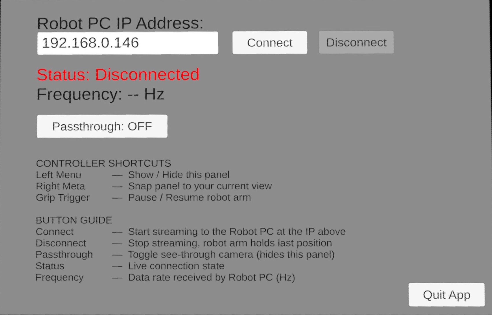

=========================
Trossen VR Teleoperation
=========================

Overview
========

The `trossen_vr <https://github.com/TrossenRobotics/trossen_vr>`_ package is a C++ and Python SDK for controlling Trossen robot arms using Meta Quest VR controllers over network communication.

This package provides a complete solution for VR-based robot teleoperation, including:

* C++ library with network communication and VR data handling
* Python bindings for easy integration with Python workflows
* Meta Quest VR headset application for wireless control
* Event-driven and manual polling control patterns
* Dual-arm support with independent deadman switches
* Real-time pose and gripper control

Requirements
============

* `nlohmann/json <https://github.com/nlohmann/json>`_ >= 3.2
* `libtrossen_arm <https://docs.trossenrobotics.com/trossen_arm/main/getting_started/software_setup.html#c>`_ (for demos)
* Python >= 3.11 (for Python bindings)
* `uv <https://docs.astral.sh/uv/>`_ (for Python environment management)
* CMake >= 3.15
* C++17 compiler

Installation
============

System Dependencies
-------------------

.. code-block:: bash

    sudo apt install -y cmake build-essential nlohmann-json3-dev
    curl -LsSf https://astral.sh/uv/install.sh | sh

Follow the `libtrossen_arm C++ installation guide <https://docs.trossenrobotics.com/trossen_arm/main/getting_started/software_setup.html#c>`_ to install the robot driver if you want to run the demos.

Clone Repository
----------------

.. code-block:: bash

    git clone https://github.com/TrossenRobotics/trossen_vr.git
    cd trossen_vr

Build C++ Library
-----------------

.. code-block:: bash

    # Configure and build
    cmake -B build
    cmake --build build -j$(nproc)

    # Install library and headers (optional, for use in other projects)
    sudo cmake --install build

Build C++ Demos (Optional)
---------------------------

.. code-block:: bash

    # Configure with demos enabled (requires libtrossen_arm)
    cmake -B build -DBUILD_DEMOS=ON
    cmake --build build -j$(nproc)

Build Python Bindings (Optional)
---------------------------------

.. code-block:: bash

    # Create Python environment
    uv sync

    # Configure with Python bindings enabled
    source .venv/bin/activate
    cmake -B build -DBUILD_PYTHON=ON

    # Build and install Python module
    cmake --build build -j$(nproc)
    sudo cmake --install build

VR Headset App
==============

Installing the APK
------------------

The Trossen VR Teleop app can be sideloaded onto a Meta Quest headset.
First, enable Developer Mode on the headset (Settings > System > Developer), then use one of the methods below.

Using Meta Quest Developer Hub (Windows only)
~~~~~~~~~~~~~~~~~~~~~~~~~~~~~~~~~~~~~~~~~~~~~~

1. Download and install `Meta Quest Developer Hub <https://developers.meta.com/horizon/downloads/package/oculus-developer-hub-win/>`_
2. Connect the headset to your PC via USB
3. In MQDH, go to **Device Manager** > **Apps** > **Install APK** and select ``assets/VR_Teleop.apk``

Using ADB (Linux / Ubuntu)
~~~~~~~~~~~~~~~~~~~~~~~~~~~

1. Install ADB:

   .. code-block:: bash

       sudo apt install adb

2. Fix permissions (required on first use):

   .. code-block:: bash

       # Create udev rules for Meta Quest
       echo 'SUBSYSTEM=="usb", ATTR{idVendor}=="2833", MODE="0666", GROUP="plugdev"' | sudo tee /etc/udev/rules.d/51-android.rules
       sudo chmod a+r /etc/udev/rules.d/51-android.rules

       # Reload udev rules
       sudo udevadm control --reload-rules
       sudo udevadm trigger

       # Restart ADB if running and reconnect headset
       adb kill-server
       adb start-server

   Disconnect and reconnect the headset USB cable after running these commands.

3. Connect the headset to your PC via USB.
   Put the headset on. A prompt will appear inside asking you to Allow USB Debugging.
   Select Always allow from this computer and confirm.

4. Verify the headset is detected:

   .. code-block:: bash

       adb devices

   You should see a device listed with status ``device``.
   If it shows ``unauthorized``, re-check the Allow USB Debugging prompt inside the headset.

5. Install the APK:

   .. code-block:: bash

       adb install assets/VR_Teleop.apk

   A ``Success`` message confirms the installation completed.

.. note::

    The app will appear in the headset's App Library.
    If it is not visible, switch the library filter to Unknown Sources.

App UI
------

    VR Teleop App UI

UI Elements
~~~~~~~~~~~

.. list-table::
    :widths: 30 70
    :header-rows: 1
    :align: center

    * - Element
      - Description
    * - **Robot PC IP Address field**
      - IP address of the PC running this ``trossen_vr`` library
    * - **Connect**
      - Connect to the robot PC and start streaming arm data
    * - **Disconnect**
      - Stop streaming (robot arm holds its last position)
    * - **Status**
      - Live connection state: ``Disconnected`` → ``Connecting`` → ``Connected`` / ``Degraded``
    * - **Frequency**
      - Data receive rate in Hz (shown once connected)
    * - **Passthrough**
      - Toggle camera passthrough view
    * - **Quit**
      - Exit the application

Controller Shortcuts
~~~~~~~~~~~~~~~~~~~~

* **Left Menu Button**: Show or hide the UI panel
* **Right Meta Button**: Snap the UI panel to in front of your current view
* **Grip / Hand Trigger (deadman switch)**: Hold to enable tracking and engage the arm.
  Release to pause.

Configuring the IP Address
---------------------------

Enter the IP address of the PC running the trossen_vr application or demo in the **Robot PC IP Address** field, then press **Connect**.
The headset and PC must be on the same network.

Ways of Operating
=================

Once connected, there are two ways to use the app:

Passthrough Mode
----------------

Press the Passthrough button in the UI to enable the headset's cameras so you can see the real world around you.
The UI panel will disappear when passthrough is active. Press the Left Menu Button on the left controller to bring it back.

Direct View (Headset Removed)
------------------------------

Remove the headset and place it somewhere with a clear view of the controllers (overhead is recommended).
This lets you observe the robot directly without a screen.

.. warning::

    **Proximity sensor limitation:** Meta does not currently provide a built-in option to disable the proximity sensor from within the app, so the headset will go to sleep immediately when removed.
    We will update the app once Meta adds support for this.
    In the meantime, two workarounds are available:

    * **Meta Quest Developer Hub (Windows only, up to 8 hours)**: Connect the headset to your PC via USB, open `Meta Quest Developer Hub <https://developers.meta.com/horizon/downloads/package/oculus-developer-hub-win/>`_, and disable the proximity sensor under Device Manager > Device actions.
      This keeps the display on for up to 8 hours.
    * **White tape method**: Cover the proximity sensor (located inside the headset near the nose bridge) with a small piece of white tape to trick the sensor into thinking the headset is worn.

Demos
=====

.. important::

    **Before running any demo**, start the Trossen VR Teleop app on your Meta Quest headset, enter the IP address of the PC, and press Connect Button.
    The headset and PC must be on the same network.

.. tip::

    **Update the robot IP addresses** in the demo source files to match your setup. The defaults are ``192.168.1.4`` (right arm) and ``192.168.1.5`` (left arm).

Controls
--------

* **Hand/Grip Trigger**: Hold to enable tracking and engage arm (deadman switch).
  Release to pause.
* **Index Trigger**: Control gripper open/close.
* **B Button** (right controller): Exit program.

Tracking and engagement happen automatically when you hold the hand trigger.
Release the trigger to pause control while keeping the program running.

C++ Demos
---------

Located in :guilabel:`demos/cpp/`:

* `event_driven_teleop <https://github.com/TrossenRobotics/trossen_vr/blob/main/demos/cpp/event_driven_teleop.cpp>`_: Event-driven dual-arm teleop using callback handlers.
  Demonstrates the Teleop API with automatic engage/pause via deadman switch.
* `manual_polling_teleop <https://github.com/TrossenRobotics/trossen_vr/blob/main/demos/cpp/manual_polling_teleop.cpp>`_: Manual frame polling with inline state tracking.
  Same functionality, different implementation pattern showing direct frame access.

.. code-block:: bash

    ./build/event_driven_teleop
    ./build/manual_polling_teleop

Python Demos
------------

Located in :guilabel:`demos/python/`:

* `event_driven_teleop.py <https://github.com/TrossenRobotics/trossen_vr/blob/main/demos/python/event_driven_teleop.py>`_: Python version of event-driven demo with callback-based control.
* `manual_polling_teleop.py <https://github.com/TrossenRobotics/trossen_vr/blob/main/demos/python/manual_polling_teleop.py>`_: Python version of manual polling demo with direct frame access.

.. code-block:: bash

    uv run demos/python/event_driven_teleop.py
    uv run demos/python/manual_polling_teleop.py
